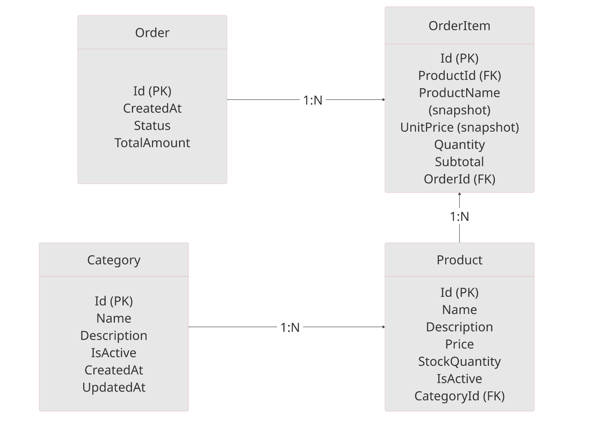

# TechStore API

API REST desenvolvida em ASP.NET para gerenciamento de catálogo, pedidos e relatórios de vendas.

O sistema permite:

* Gestão de Categorias
* Gestão de Produtos
* Registro e confirmação de vendas
* Controle de estoque
* Relatórios financeiros

---

# Tecnologias Utilizadas

* .NET 10
* ASP.NET Core
* Entity Framework Core
* SQL Server
* Swagger
* LINQ

---

# Estrutura do Projeto

```
TechStore
│
├── Domain
│   ├── Entities
│   ├── Enums
│
├── Application
│   └── DTOs
│
├── Infrastructure
│   └── Data
│
├── Controllers
│
└── Migrations
```

Arquitetura baseada em separação de responsabilidades:

* **Domain** → regras de negócio
* **Application** → contratos de entrada/saída (DTOs)
* **Infrastructure** → persistência
* **Controllers** → camada HTTP

---

# Como Rodar o Projeto

## Pré-requisitos

* .NET SDK 8 ou superior
* SQL Server (local ou container)

---

## Clonar o repositório

```bash
git clone <URL_DO_REPOSITORIO>
cd TechStore
```

---

## Configurar Connection String

No arquivo:

```
appsettings.json
```

Configure:

```json
"ConnectionStrings": {
  "DefaultConnection": "Server=localhost;Database=TechStoreDb;Trusted_Connection=True;TrustServerCertificate=True;"
}
```

Se estiver usando Docker ou outro servidor, ajuste conforme necessário.

---

## Aplicar Migrations

```bash
dotnet ef database update
```

Isso irá:

* Criar o banco
* Criar as tabelas
* Aplicar constraints e relacionamentos

---

## Executar a aplicação

```bash
dotnet run
```

A API estará disponível em:

```
https://localhost:XXXX/swagger
```

---

# Modelo de Banco de Dados

## Entidades Principais

* Category
* Product
* Order
* OrderItem

---

# Diagrama do Banco de Dados

<p align="center">
  
  <br>
  <em>Figura 1 — Modelo relacional da TechStore</em>
</p>


---

# Regras de Negócio Implementadas

* Produtos inativos não podem ser vendidos
* Estoque é validado antes da confirmação da venda
* Subtração de estoque ocorre apenas após confirmação
* Relatórios consideram apenas pedidos confirmados
* Snapshot garante integridade histórica

---

# Endpoints Principais

## Categorias

* Criar/Listar categoria
* Ativar/Desativar categoria

## Produtos

* Criar produto
* Listar produtos (filtro e ordenação)
* Consultar estoque
* Repor estoque
* Ativar/Desativar produto

## Pedidos

* Registrar venda
* Confirmar venda
* Buscar pedido por ID

## Relatórios

* Produtos mais vendidos
* Faturamento total
* Faturamento por período

---

# Conceitos Aplicados

* Encapsulamento de regras no domínio
* Snapshot para integridade histórica
* Separação entre operações transacionais e analíticas
* Uso de agregações no banco via LINQ